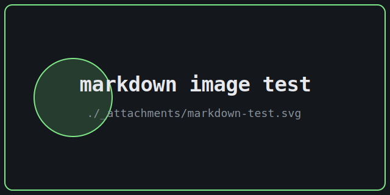

Welcome. This is a dark, minimal corner of the internet where I'll be dropping notes on programming, cyber-security, reverse engineering, and the occasional side quest.

## How this works

- Posts are plain markdown in `src/content/blog/`.
- I write them in **Obsidian**, opening that folder as a vault.
- A `git push` to `main` kicks off a GitHub Actions build and ships the site to GitHub Pages.

## A small code sample

```bash
# rebuild locally
npm run build
npm run preview
```

```python
def xor(a: bytes, b: bytes) -> bytes:
    return bytes(x ^ y for x, y in zip(a, b))
```

That's the whole thing. More soon.

## Markdown feature test

A scratch section to confirm every markdown feature renders. Inline styles: **bold**, *italic*, ***bold italic***, ~~strikethrough~~, `inline code`, and a [link to Astro](https://astro.build). A bare autolink: https://example.com

### Image



### Blockquote

> Impact comes from what data was protected, not from whether an endpoint technically discloses something.
>
> > Nested quotes work too.

### Lists

Unordered, with nesting:

- First item
- Second item
  - Nested item
  - Another nested item
- Third item

Ordered:

1. Recon
2. Enumerate
3. Report

Task list:

- [x] Add analytics
- [x] Grid layout
- [ ] Ship it

### Table

| Vuln class | Typical severity | Chainable |
| ---------- | ---------------- | --------- |
| IDOR       | High             | Yes       |
| Open redirect | Low           | Yes       |
| Debug page | Medium           | Sometimes |

### Code block

```javascript
export function firstParagraph(body, maxLen = 160) {
  return body.split(/\n\s*\n/)[0].slice(0, maxLen);
}
```

### Horizontal rule

---

### Footnote

Some findings only matter once chained.[^1]

[^1]: Footnotes are part of GitHub-flavored markdown, enabled by default in Astro.
